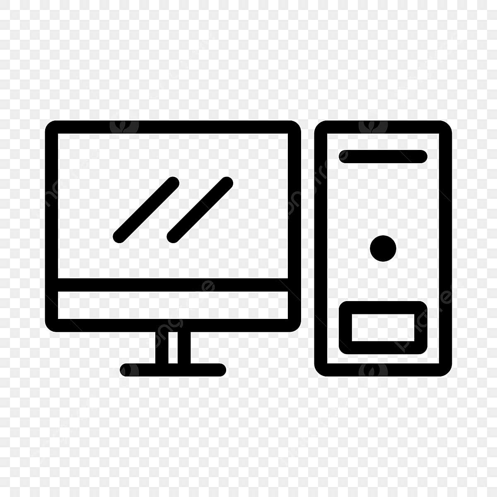

# Cyber-Portfolio: Arnab Das (vibecoder) 🚀

Welcome to my 3D Interactive Portfolio — a fusion of high-performance 3D graphics, a functional CLI terminal, and a simulated Ubuntu Desktop environment.



## 🌟 Key Features

### 1. **Interactive 3D Lanyard**
A physics-driven 3D lanyard and ID badge built with **React Three Fiber** and **Rapier Physics**.
- **Physics**: Real-time rope and joint physics for the band and card.
- **Interactions**: Drag the card, flip it to see the back, and watch it respond to gravity and motion.
- **Lighting**: Custom Environment mapping and Lightformers for a premium aesthetic.

### 2. **Custom Terminal (ArnabOS CLI)**
A fully functional command-line interface that feels like a real Linux terminal.
- **Themes**: Switch between `default` (purple/neon), `matrix` (hacker green), and `retro` (amber CRT).
- **Commands**: `whoami`, `skills`, `projects`, `contact`, `music`, and even a fake `hack` command.
- **History**: Full command history support using Arrow keys.

### 3. **Simulated Ubuntu Desktop**
A complete OS-in-browser experience triggered by a "boot" sequence from the terminal.
- **Ubuntu UI**: Authentic top status bar with live clock, sidebar dock, and desktop shortcuts.
- **Draggable Windows**: A custom window manager for multitasking.
- **Integrated Apps**:
  - **Spotify Clone**: A working music player with play/pause/skip and progress tracking.
  - **Terminal**: The main Terminal component remounted inside a window.
  - **Resume Viewer**: Direct PDF embedding for easy viewing.

## 🛠 Tech Stack

- **Core**: React 18
- **3D Engine**: Three.js, React Three Fiber, @react-three/drei
- **Physics**: @react-three/rapier
- **Styles**: Vanilla CSS (Cyberpunk & Glassmorphism aesthetics)
- **Audio**: HTML5 Audio API

## 🚀 Getting Started

1. **Clone the repository**
   ```bash
   git clone <repository-url>
   cd portfolio
   ```

2. **Install dependencies**
   ```bash
   npm install
   ```

3. **Run the development server**
   ```bash
   npm start
   ```

4. **Build for production**
   ```bash
   npm run build
   ```

## 📂 Directory Structure

```text
portfolio/
├── public/                 # Static assets (Music, PDFs, Icons)
│   ├── music/              # Custom MP3/M4A tracks
│   └── Arnab_Das_CV.pdf    # Downloadable Resume
├── src/                    # Source code
│   ├── App.js              # Main Entry Point & Lanyard Scene
│   ├── Desktop.js          # Simulated OS Component
│   ├── Terminal.js         # CLI Terminal & Commands
│   ├── MusicPlayer.js      # Spotify-themed UI
│   └── styles.css          # Global and Component Styles
└── package.json            # Project configuration
```

---
Crafted with 💜 by Arnab Das
